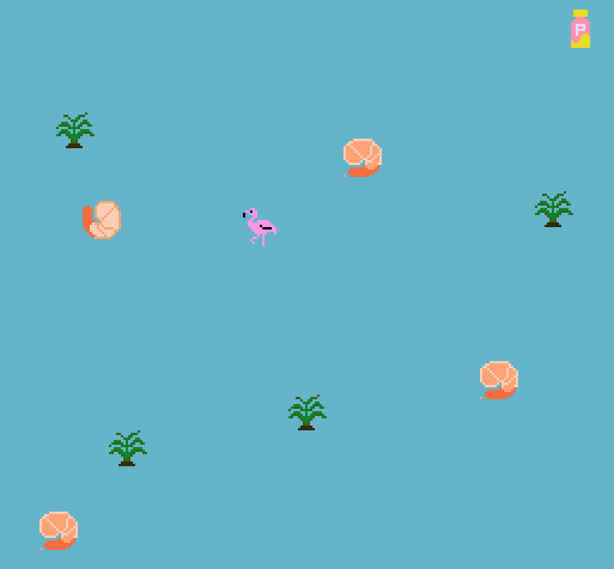

# Flamingo!

Author: Emma Liu

*"How many shrimps do you have to eat\
Before you make your skin turn pink?\
Eat too much and you'll get sick\
Shrimps are pretty rich"*

Except from ["Flamingo" by Kero Kero Bonito](https://www.youtube.com/watch?v=rY-FJvRqK0E&ab_channel=KeroKeroBonito)

Play along as a flamingo, who needs to navigate the waters to acquire succulent shrimp to give him his species's saccharine pinkness!

Screen Shot:

How Your Asset Pipeline Works:

Using GIMP, I drew the sprites as 16x16 PNG files. Helper routines called within the ShrimpMode constructor establish the rest of the asset pipeline routine. For each sprite, I ported data from its asset image using `load_png`. Next I grab the palette of the sprite (at most 3 colors, excluding transparency). Finally, since all sprites are 16x16, I chunked processing the sprite into 4 (2x2) 8x8-bit tiles (setting their tile bits accordingly).

The flamingo utilizes 4 separate sets of images to convey increasing pinkness, which entailed 4 different sets of palettes and 4 tiles. (Both styles of shrimps share the same palette, since I was limited by using several palettes for the flamingo to change color. To make the shrimps look slightly different and thus overall making the scene more interesting, I cheated and colored a small bit at the corner of the other shrimp to give it an opposing palette.)

How To Play:

To play, use your keyboard up/down/left/right keys to move across the landscape as the flamingo. Your objective is to eat as many shrimp as possible, to give you a wonderful pink hue; as you eat more shrimp, you'll get more pink, and more energy! to run around. Eventually, once you eat a lot of shrimp, you'll start to feel a little queasy. Dash quickly to pick up some Pepto-Bismol and you'll be good to keep on eating (infinite shrimp)!

Sources: 

The pixel art assets were created by me, inspired by the following pixel art:
- [Shrimps: Anastasia Kozheko](https://www.artstation.com/artwork/3oebZY)
- [Flamingo: Chibitheo](https://www.dreamstime.com/flamingo-pixel-image-vector-illustration-art-image222128976)

This game was built with [NEST](NEST.md).

